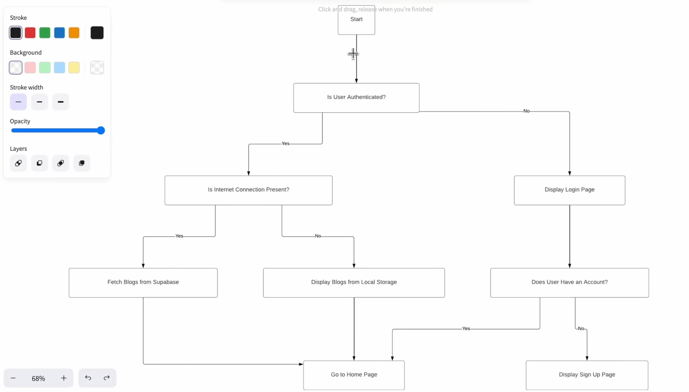

# Quill Pell - Flutter Blog App

Welcome to Quill Pell, a Flutter blog application built with clean architecture principles. This README provides an overview of the app's features, technologies used, and implementation details.

## Table of Contents
- [Installation](#installation)
- [Features](#features)
- [Technologies Used](#technologies-used)
- [Implementation Details](#implementation-details)
- [Diagram for Better Understanding](#diagram-for-better-understanding)
- [SOLID Principles](#solid-principles)
- [Implementation Details](#implementation-details)
- [Bloc Extension](#bloc-extension)
- [Reusable Code with Domain Layer and Repository Pattern](#reusable-code-with-domain-layer-and-repository-pattern)

## Diagram for Better Understanding

## Demonstrations

## Installation
To get started with the Quill Pell Flutter application, follow these steps:
1. Clone the repository from [GitHub](https://github.com/KevalKThumar/Quill-Pell.git).
2. Ensure you have Flutter SDK installed on your machine.
3. Open the project in your preferred Flutter IDE (e.g., Android Studio or Visual Studio Code).
4. Run `flutter pub get` to install the required dependencies.
5. Start the application on an emulator or a physical device using `flutter run`.

## Features
- **Signup:** Users can create accounts with Quill Pell, providing their name, email, and password.
- **Login:** Registered users can log in securely to access their account.
- **Signout:** Users can sign out of their account.
- **Blog Management:** Users can upload, read, and delete their blog posts.
- **Offline Access:** Quill Pell utilizes caching with Hive for offline access to previously read blog posts.
- **Live checking of intenet:** Quill Pell checks for internet connection before posting a blog post.
- **Dynamic Reading Time:** Users can view dynamically calculated reading times for each blog post.
- **State Management:** Bloc and Cubit are employed for robust state management.
- **Backend:** Supabase serves as the backend for storing user data and blog posts.

## Technologies Used
- **UI:** Flutter framework is used for building the user interface.
- **Backend:** Supabase provides the backend infrastructure for user authentication and data storage.
- **State Management:** Bloc and Cubit libraries manage the app's state effectively.
- **Local Storage:** Hive database is utilized for efficient local storage of user and blog data.

## Diagram for Better Understanding
A side diagram is included in the tutorial for better understanding of the app's architecture and flow.

## SOLID Principles
The app adheres to SOLID principles in clean architecture, ensuring code maintainability and scalability.

## Implementation Details
The tutorial covers implementation details such as user signup, login, and management of user data.

## Bloc Extension
Bloc extension is utilized for managing multiple Blocs effectively in the app.

## Reusable Code with Domain Layer and Repository Pattern
The app architecture includes a domain layer and repository pattern for reusable and maintainable code.

Happy coding!
